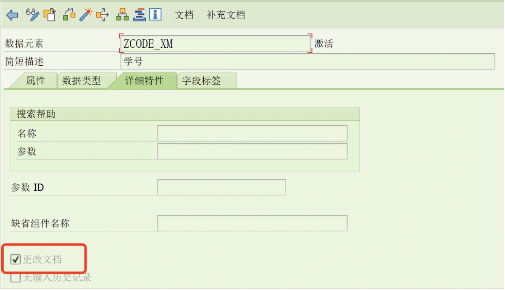
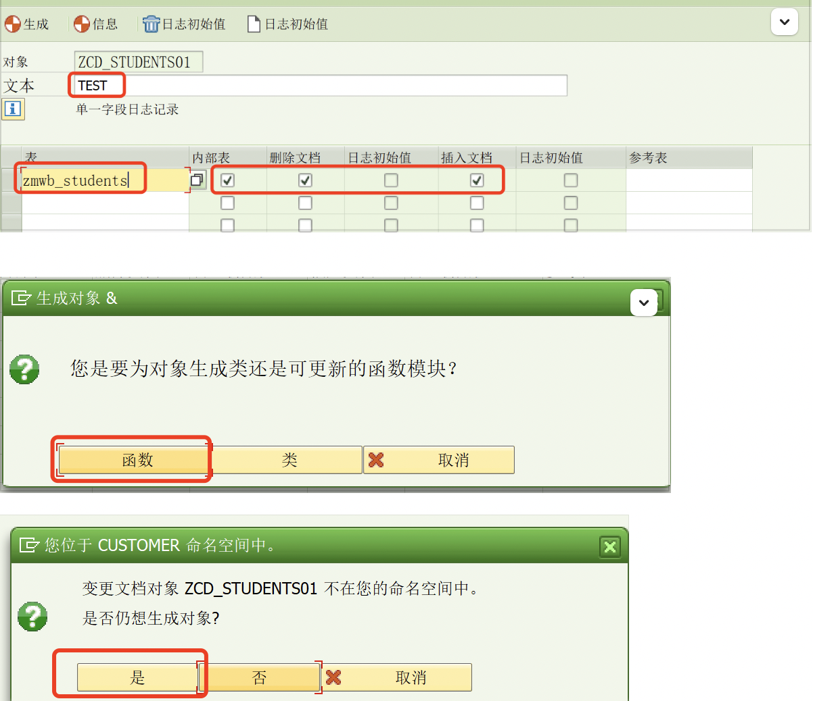
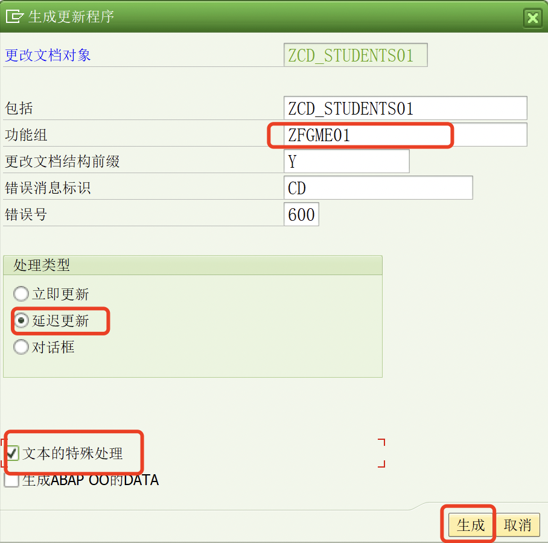
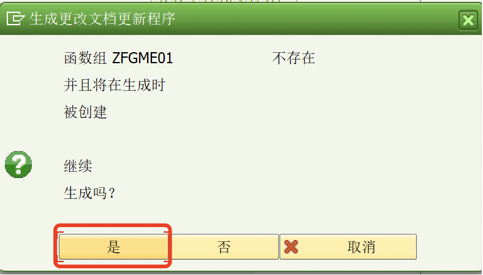
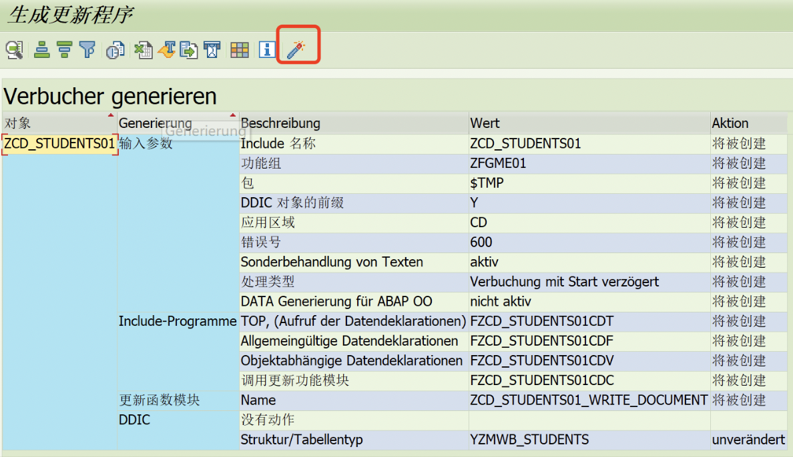
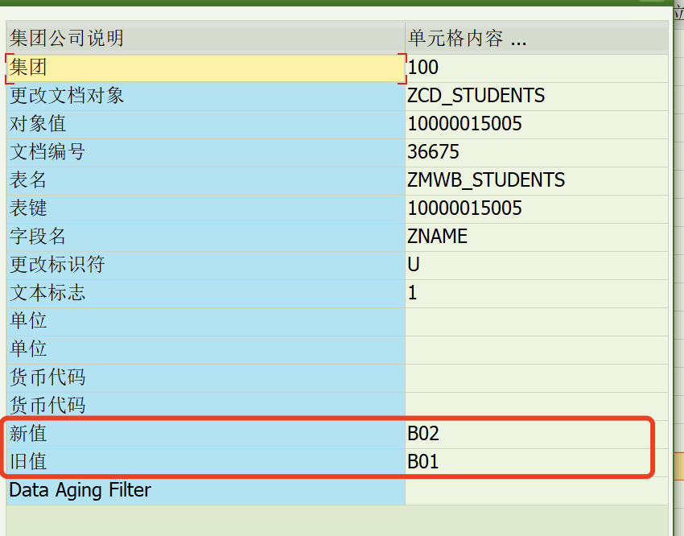
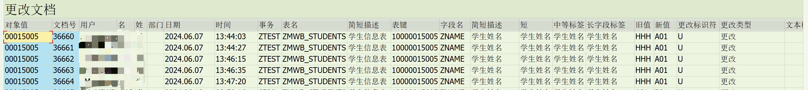

## **Change Document**

用途：记录自建表在程序中被修改、插入、删除时记录日志

创建用于记录的自检表 示例中采用自建学生表 zmwb_students

要记录的字段对应的数据元素中的详细特性勾选上更改文档



事务码 SCDO 创建变更文档对象

填入自定义对象名称->创建


填写文本->记录的表->勾选框内选项->生成->函数->是



输入自定义功能组、勾选延迟更新、文本特殊处理->生成->是





点击激活



这里生成的ZCD_STUDENTS01_WRITE_DOCUMENT为后续要使用的日志函数

```ABAP
"更改操作"
DATA: lt_yztable TYPE TABLE OF yzmwb_students,
      ls_yztable TYPE yzmwb_students,
      lt_xztable TYPE TABLE OF yzmwb_students,
      ls_xztable TYPE yzmwb_students.

DATA: objectid TYPE cdhdr-objectid,
      icdtxt   TYPE TABLE OF cdtxt.

DATA: obj_exception TYPE REF TO cx_ai_system_fault.

DATA:lt_students TYPE STANDARD TABLE OF zmwb_students,
     ls_students TYPE zmwb_students.

CLEAR:lt_xztable,lt_yztable.


SELECT SINGLE * FROM zmwb_students INTO @DATA(ls_s) WHERE zcode = '00015' AND zschool = '005'.
IF sy-subrc = 0.
  "用表KEY键组成ObjectID
  objectid = sy-mandt && ls_s-zcode && ls_s-zschool.

  " 旧值
  ls_yztable = CORRESPONDING #( ls_s ).
  ls_yztable-kz = 'U'.
  APPEND ls_yztable TO lt_yztable. CLEAR:ls_yztable.

  " 修改的值
  ls_s-zname = 'B02'.

  " 新值
  ls_xztable = CORRESPONDING #( ls_s ).
  ls_students = CORRESPONDING #( ls_s ).
  ls_xztable-kz = 'U'.
  APPEND ls_xztable TO lt_xztable. CLEAR:ls_xztable.
  APPEND ls_students TO lt_students. CLEAR:ls_students.

  " 更新数据库
  MODIFY zmwb_students FROM TABLE lt_students.
  COMMIT WORK.

  CALL FUNCTION 'ZCD_STUDENTS_WRITE_DOCUMENT'
    EXPORTING
      objectid            = objectid
      tcode               = sy-tcode
      utime               = sy-uzeit
      udate               = sy-datum
      username            = sy-uname
*     upd_icdtxt_zcd_students = 'U'
      upd_zmwb_students   = 'U'
    TABLES
      icdtxt_zcd_students = icdtxt
      xzmwb_students      = lt_xztable " 新值
      yzmwb_students      = lt_yztable. " 旧值
  IF sy-subrc =  0.
    COMMIT WORK..
  ENDIF.
ENDIF.
```

```abap
"插入操作"
DATA: lt_yztable TYPE TABLE OF yzmwb_students,
      ls_yztable TYPE yzmwb_students,
      lt_xztable TYPE TABLE OF yzmwb_students,
      ls_xztable TYPE yzmwb_students.

DATA: objectid TYPE cdhdr-objectid,
      icdtxt   TYPE TABLE OF cdtxt.

DATA: obj_exception TYPE REF TO cx_ai_system_fault.

DATA:lt_students TYPE STANDARD TABLE OF zmwb_students,
     ls_students TYPE zmwb_students.

CLEAR:lt_xztable,lt_yztable.

ls_students = VALUE #( zcode = '00018' zschool = '001' zname = 'B03' zsex = 'M' zweigh = 20 zunit = 'G'  ).
ls_xztable = CORRESPONDING #( ls_students ).
ls_xztable-kz = 'I'.
APPEND ls_xztable TO lt_xztable. CLEAR:ls_xztable.
APPEND ls_students TO lt_students. CLEAR:ls_students.

ls_students = VALUE #( zcode = '00019' zschool = '002' zname = 'B04' zsex = 'S' zweigh = 21 zunit = 'KG'  ).
ls_xztable = CORRESPONDING #( ls_students ).
ls_xztable-kz = 'I'.
APPEND ls_xztable TO lt_xztable. CLEAR:ls_xztable.
APPEND ls_students TO lt_students. CLEAR:ls_students.


objectid = 'INSERTDATA'.
" 更新数据库
MODIFY zmwb_students FROM TABLE lt_students.

CALL FUNCTION 'ZCD_STUDENTS_WRITE_DOCUMENT'
  EXPORTING
    objectid                = objectid
    tcode                   = sy-tcode
    utime                   = sy-uzeit
    udate                   = sy-datum
    username                = sy-uname
    upd_icdtxt_zcd_students = 'I'
    upd_zmwb_students       = 'I'
  TABLES
    icdtxt_zcd_students     = icdtxt
    xzmwb_students          = lt_xztable. " 新值
IF sy-subrc =  0.
  COMMIT WORK.
ENDIF.
```

删除操作同理

```
upd_icdtxt_zcd_students = 'D'
upd_zmwb_students       = 'D'
```

程序之后的查看更改记录

查看CDHDR和CDPOS表，发现新增加了数据插入、修改、删除记录

CDHDR


CDPOS



此外 事务RSSCD100 也可查看更改记录



参考链接：

http://www.baidusap.com/abap/others/7442

